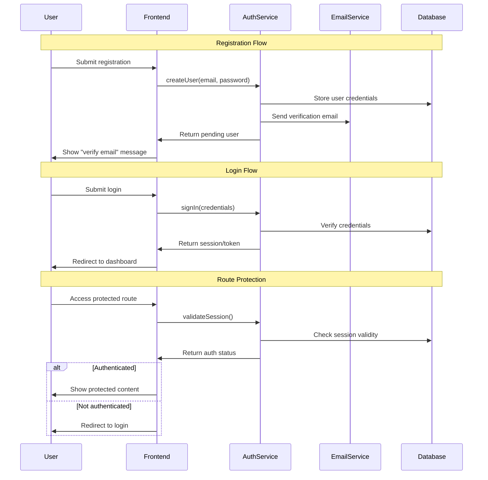
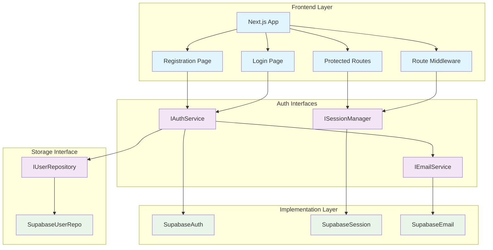

# User Authentication Module Specification

## Implementation Instruction

**Implement user authentication module with:**

## Architecture

### Sequence Diagram


### Component Diagram


### Design Principles
- Interface-based design (IAuthService, ISessionManager)
- Supabase implementation layer
- Next.js middleware for route protection

## Acceptance Criteria

### Registration
- User registers via Supabase auth with email/password
- Email verification required before login
- Redirect to dashboard after verification
- Store user profile in Supabase database

### Login
- Authenticate via Supabase
- Session auto-managed by Supabase
- Redirect authenticated users from login page

### Password Reset
- Trigger via Supabase auth
- User receives reset email
- New password updates in Supabase

## Technology Stack
- **Auth**: Supabase Auth
- **Database**: Supabase PostgreSQL
- **Frontend**: Next.js with React
- **Session**: Supabase client handles automatically
- **Route Protection**: Next.js middleware

## Gherkin Scenarios

```gherkin
Feature: User Registration
Scenario: Successful registration
  Given I am on registration page
  When I enter email "user@example.com" and password "SecurePass123"
  And I click "Register"
  Then Supabase creates unconfirmed account
  And verification email is sent
  And I see "Check your email to verify account"

Scenario: Email verification
  Given I have unconfirmed account
  When I click verification link in email
  Then account becomes active
  And I'm redirected to dashboard

Feature: User Login
Scenario: Login with verified account
  Given I have verified account
  When I enter correct credentials
  Then I'm logged in and redirected to dashboard

Scenario: Login with unverified account
  When I try to login with unverified account
  Then I see "Please verify your email first"

Scenario: Invalid credentials
  When I enter wrong password
  Then I see "Invalid login credentials"

Feature: Password Reset
Scenario: Request password reset
  Given I'm on login page
  When I click "Forgot password" and enter my email
  Then Supabase sends reset link
  And I see "Password reset email sent"
```

## Technical Requirements
- shadcn/ui login-01 block as base
- React Hook Form + Zod validation
- Toast error handling
- Dark mode default

## Component Structure
```
components/
├── auth/
│   ├── login-form.tsx       # React Hook Form + Zod
│   ├── register-form.tsx    # Email, password, confirm
│   ├── forgot-password-form.tsx
│   ├── reset-password-form.tsx
│   └── auth-layout.tsx      # Shared layout wrapper
├── ui/
│   ├── button.tsx           # shadcn/ui
│   ├── input.tsx            # shadcn/ui
│   ├── card.tsx             # shadcn/ui
│   ├── toast.tsx            # shadcn/ui
│   └── form.tsx             # shadcn/ui
└── hooks/
    └── use-auth.tsx         # Supabase auth state
```

## Implementation Notes
- Use Next.js middleware for server-side route protection
- Implement loading states during auth operations
- Handle all error scenarios with appropriate user feedback
- Ensure responsive design for mobile devices