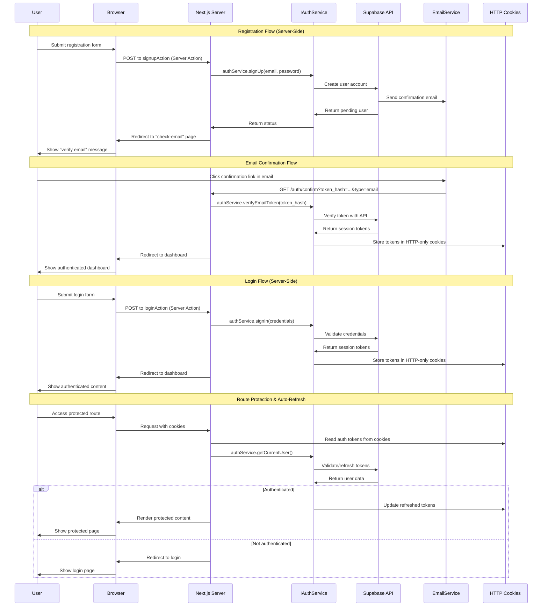
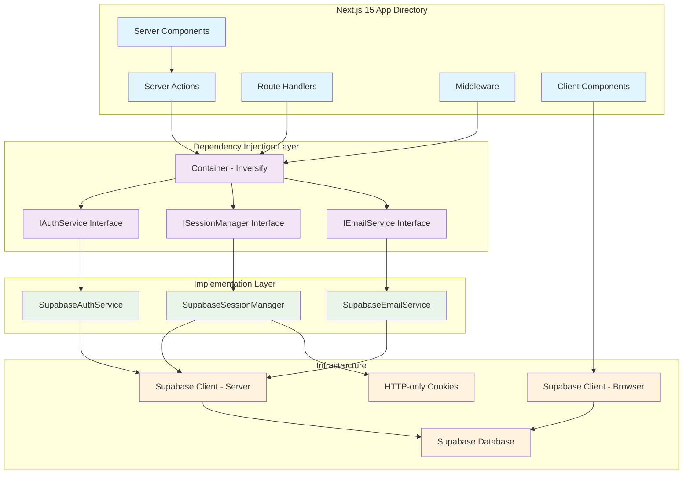

# User Authentication Module Specification - Server-Side

## Implementation Instruction

**Implement user authentication module with Next.js 15 App Directory and server-side rendering approach:**

## Architecture

### Server-Side Authentication Sequence Diagram


### Component & Service Architecture


### Design Principles
- **Server-Side First**: All authentication logic on Next.js server
- **Dependency Injection**: Inversify container for loose coupling
- **Interface-driven**: IAuthService, ISessionManager for testability
- **HTTP-only Cookies**: Secure token storage (not localStorage)
- **Server Actions**: Form submissions without client-side JS
- **PKCE Flow**: Server-side token exchange for maximum security
- **Dark Theme**: Default dark mode throughout the application

## Acceptance Criteria

### Landing Page
- Public landing page at "/" showcasing "Building something amazing..."
- For anonymous users: Show "Login" and "Sign Up" buttons
- For authenticated users: Show "Go to Dashboard" button, hide Login/Sign Up
- Responsive design with dark theme by default

### Auth Route Protection
- Authenticated users accessing "/auth/*" pages are redirected to "/dashboard"
- This includes /auth/login, /auth/register, /auth/forgot-password pages
- Prevents authenticated users from accessing unnecessary auth flows

### Registration
- User registers via server action calling IAuthService
- Client-side validation with React Hook Form + Zod
- Email confirmation required before login (link-based, not OTP)
- Email contains server-side callback URL with token_hash
- Account activation handled by route handler
- Redirect to dashboard after email confirmation
- User profile stored via IUserRepository

### Login
- Authenticate via server action calling IAuthService
- Client-side validation with React Hook Form + Zod
- Session tokens stored in HTTP-only cookies on server
- Automatic middleware-based session refresh
- Redirect authenticated users from login page via server component

### Password Reset
- Trigger via server action calling IAuthService
- User receives reset email with server-side callback URL
- Password update handled via server action
- New password validates and updates via IAuthService

### Route Protection
- Next.js middleware validates sessions on every request
- Server components use ISessionManager.getCurrentUser()
- Automatic token refresh in middleware
- Redirect to login for unauthenticated users

## Technology Stack
- **Runtime**: Node.js with Next.js 15 App Directory
- **Framework**: React 19 with TypeScript
- **Auth**: Supabase Auth with @supabase/ssr
- **Database**: Supabase PostgreSQL
- **Session**: HTTP-only cookies managed by server
- **DI Container**: Inversify with reflect-metadata
- **Forms**: React Hook Form with Zod validation
- **UI**: shadcn/ui components with dark theme default
- **Styling**: Tailwind CSS v4
- **Icons**: lucide-react
- **Route Protection**: Next.js middleware + server components

## Project Structure
```
app/
├── page.tsx                      # Landing page - "Building something amazing"
├── auth/
│   ├── login/
│   │   ├── page.tsx              # Login form (Server Component + RHF)
│   │   └── actions.ts            # loginAction, signupAction
│   ├── register/
│   │   ├── page.tsx              # Registration form
│   │   └── actions.ts            # Server actions
│   ├── forgot-password/
│   │   ├── page.tsx              # Password reset form
│   │   └── actions.ts            # Reset actions
│   ├── confirm/
│   │   └── route.ts              # Email confirmation handler
│   └── reset-password/
│       ├── page.tsx              # New password form
│       └── actions.ts            # Password update action
├── dashboard/
│   └── page.tsx                  # Protected page (Server Component)
├── middleware.ts                 # Session management & auto-refresh
├── globals.css                   # Dark theme default styles
└── layout.tsx                    # Root layout with dark theme

lib/
├── auth/
│   ├── interfaces/
│   │   ├── IAuthService.ts       # Authentication interface
│   │   ├── ISessionManager.ts    # Session management interface
│   │   └── IUserRepository.ts    # User data interface
│   ├── services/
│   │   ├── SupabaseAuthService.ts    # Supabase implementation
│   │   ├── SupabaseSessionManager.ts # Session implementation
│   │   └── SupabaseUserRepository.ts # User data implementation
│   └── container.ts              # Inversify DI container
├── supabase/
│   ├── server.ts                 # Server-side Supabase client
│   ├── client.ts                 # Browser-side Supabase client
│   └── middleware.ts             # Middleware helper
├── validations/
│   ├── auth.ts                   # Zod schemas for auth forms
│   └── index.ts                  # Validation exports
└── types/
    └── auth.ts                   # Auth-related TypeScript types

components/
├── landing/
│   ├── Hero.tsx                 # Landing hero section
│   ├── BuildingStatus.tsx       # "Building something amazing" component
│   └── CTAButtons.tsx           # Conditional Login/Register or Dashboard button
├── auth/
│   ├── LoginForm.tsx            # React Hook Form with Server Action
│   ├── RegisterForm.tsx         # React Hook Form with Server Action
│   ├── ForgotPasswordForm.tsx   # React Hook Form
│   └── AuthLayout.tsx           # Shared auth layout wrapper
└── ui/
    ├── button.tsx               # shadcn/ui button
    ├── input.tsx                # shadcn/ui input
    ├── card.tsx                 # shadcn/ui card
    ├── form.tsx                 # shadcn/ui form
    ├── label.tsx                # shadcn/ui label
    └── toast.tsx                # shadcn/ui toast/sonner
```

## Gherkin Scenarios (Server-Side Flows)

```gherkin
Feature: Landing Page Experience
Scenario: Public user visits landing page
  Given I am not authenticated
  When I visit "/"
  Then I see "Building something amazing..." hero section
  And I see "Login" and "Sign Up" buttons
  And the interface uses dark theme by default

Scenario: Authenticated user visits landing page
  Given I am logged in with valid session
  When I visit "/"
  Then I see "Building something amazing..." hero section
  And I see "Go to Dashboard" button instead of Login/Sign Up
  And Login and Sign Up buttons are hidden
  And the interface uses dark theme by default

Feature: Auth Route Protection
Scenario: Authenticated user tries to access auth pages
  Given I am logged in with valid session
  When I visit "/auth/login" or "/auth/register" or "/auth/forgot-password"
  Then I am automatically redirected to "/dashboard"

Feature: User Registration (Server-Side with Validation)
Scenario: Successful registration with client-side validation
  Given I am on registration page
  When I enter email "user@example.com" and password "SecurePass123"
  And React Hook Form validates the data with Zod schema
  And I submit the form (triggers server action)
  Then server action calls IAuthService.signUp()
  And Supabase creates unconfirmed account
  And confirmation email is sent with server callback URL
  And I'm redirected to "check your email" page
  And I see "Check your email to verify account"

Scenario: Registration with client-side validation errors
  Given I am on registration page
  When I enter invalid email "invalid-email"
  Then React Hook Form shows validation error immediately
  And Zod schema prevents form submission
  And no server action is triggered

Feature: User Login (Server-Side with Validation)
Scenario: Login with client-side and server-side validation
  Given I have verified account
  When I enter correct credentials
  And React Hook Form validates the input
  And I submit the form
  Then server action calls IAuthService.signIn()
  And tokens are stored in HTTP-only cookies on server
  And I'm redirected to dashboard via server action

Feature: Route Protection and Session Management
Scenario: Access protected route with valid session
  Given I am logged in with tokens in cookies
  When I navigate to "/dashboard"
  Then middleware reads cookies and validates session
  And server component calls ISessionManager.getCurrentUser()
  And protected content is rendered server-side

Scenario: Automatic token refresh
  Given I have expired access token in cookies
  When I access any protected route
  Then middleware detects expired token
  And automatically refreshes using refresh token
  And updates cookies with new tokens
  And continues with original request

Feature: Password Reset (Server-Side)
Scenario: Request password reset with validation
  Given I'm on forgot password page
  When I enter my email with React Hook Form validation
  And I submit the form
  Then server action calls IAuthService.requestPasswordReset()
  And reset email is sent with server callback URL
  And I see "Password reset email sent"
```

## Technical Implementation Details

### Dependency Injection Setup
```typescript
// lib/auth/container.ts
import 'reflect-metadata'
import { Container } from 'inversify'
import { IAuthService } from './interfaces/IAuthService'
import { ISessionManager } from './interfaces/ISessionManager'
import { SupabaseAuthService } from './services/SupabaseAuthService'
import { SupabaseSessionManager } from './services/SupabaseSessionManager'

const container = new Container()
container.bind<IAuthService>('IAuthService').to(SupabaseAuthService)
container.bind<ISessionManager>('ISessionManager').to(SupabaseSessionManager)

export { container }
```

### Server Action with DI Pattern
```typescript
// app/auth/login/actions.ts
'use server'
import { container } from '@/lib/auth/container'
import { IAuthService } from '@/lib/auth/interfaces/IAuthService'
import { loginSchema } from '@/lib/validations/auth'

export async function loginAction(formData: FormData) {
  // Server-side validation with Zod
  const validatedFields = loginSchema.safeParse({
    email: formData.get('email'),
    password: formData.get('password')
  })

  if (!validatedFields.success) {
    return { error: 'Invalid fields' }
  }

  const authService = container.get<IAuthService>('IAuthService')
  
  await authService.signIn(validatedFields.data)
  
  redirect('/dashboard')
}
```

### React Hook Form Integration
```typescript
// components/auth/LoginForm.tsx
'use client'
import { useForm } from 'react-hook-form'
import { zodResolver } from '@hookform/resolvers/zod'
import { loginSchema } from '@/lib/validations/auth'
import { loginAction } from '@/app/auth/login/actions'

export function LoginForm() {
  const form = useForm({
    resolver: zodResolver(loginSchema),
    defaultValues: { email: '', password: '' }
  })

  return (
    <form action={loginAction}>
      <Input 
        {...form.register('email')}
        type="email" 
        placeholder="Email"
      />
      {form.formState.errors.email && (
        <p className="text-destructive">{form.formState.errors.email.message}</p>
      )}
      
      <Input 
        {...form.register('password')}
        type="password" 
        placeholder="Password"
      />
      {form.formState.errors.password && (
        <p className="text-destructive">{form.formState.errors.password.message}</p>
      )}
      
      <Button type="submit">Login</Button>
    </form>
  )
}
```

### Landing Page Component
```typescript
// app/page.tsx
import { container } from '@/lib/auth/container'
import { ISessionManager } from '@/lib/auth/interfaces/ISessionManager'
import { Hero } from '@/components/landing/Hero'
import { BuildingStatus } from '@/components/landing/BuildingStatus'
import { CTAButtons } from '@/components/landing/CTAButtons'

export default async function LandingPage() {
  const sessionManager = container.get<ISessionManager>('ISessionManager')
  const user = await sessionManager.getCurrentUser()

  return (
    <div className="min-h-screen bg-background text-foreground">
      <Hero />
      <BuildingStatus />
      <CTAButtons isAuthenticated={!!user} />
    </div>
  )
}
```

### Auth Pages Protection
```typescript
// app/auth/login/page.tsx
import { redirect } from 'next/navigation'
import { container } from '@/lib/auth/container'
import { ISessionManager } from '@/lib/auth/interfaces/ISessionManager'
import { LoginForm } from '@/components/auth/LoginForm'

export default async function LoginPage() {
  const sessionManager = container.get<ISessionManager>('ISessionManager')
  const user = await sessionManager.getCurrentUser()

  // Redirect authenticated users to dashboard
  if (user) {
    redirect('/dashboard')
  }

  return <LoginForm />
}
```

### Environment Variables
```env
# .env.local
NEXT_PUBLIC_SUPABASE_URL=your_supabase_project_url
NEXT_PUBLIC_SUPABASE_ANON_KEY=your_supabase_anon_key

# Supabase Dashboard Configuration:
# 1. Set Site URL to: https://your-app.com
# 2. Add Redirect URLs:
#    - https://your-app.com/auth/confirm
#    - https://your-app.com/auth/reset-password
# 3. Update email templates to use server-side URLs
```

### Dark Theme Configuration
Dark theme is configured through shadcn/ui and Tailwind v4 default settings. The application uses dark mode by default across all components and pages.

## Security Features
- **HTTP-only Cookies**: Tokens inaccessible to client-side JavaScript
- **Server-side Validation**: All auth logic runs on Next.js server
- **Client-side Validation**: React Hook Form + Zod prevents invalid submissions
- **Automatic Token Refresh**: Middleware handles expired tokens transparently
- **PKCE Flow**: Secure code exchange for token acquisition
- **Interface Abstraction**: Easy to switch auth providers without code changes
- **Server Components**: Protected pages render server-side with validated sessions
- **Dark Theme Security**: Reduced screen burn-in and eye strain

## Performance Considerations
- **Server-Side Rendering**: Fast initial page loads with authenticated content
- **Middleware Efficiency**: Lightweight session validation on every request
- **Cookie Size**: Minimal token storage in secure cookies
- **Automatic Refresh**: Background token renewal without user interaction
- **Client-side Validation**: Immediate feedback without server round-trips
- **Component Optimization**: Lazy loading and code splitting for better performance